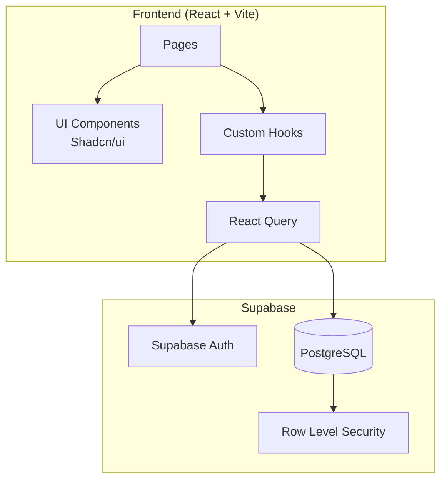
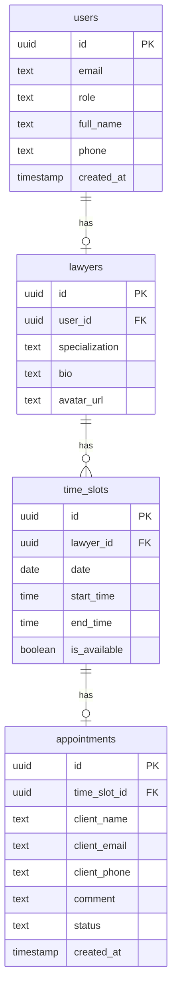

# Design Document: Lawyer Booking System

## Overview

Система онлайн-записи на консультации для адвокатского бюро, построенная на React + TypeScript + Vite с использованием Supabase в качестве бэкенда. Система поддерживает три роли пользователей: клиенты (без авторизации), юристы и суперадмины.

### Технологический стек

- **Frontend**: React 18 + TypeScript + Vite
- **Styling**: Tailwind CSS + Shadcn/ui
- **Backend**: Supabase (Auth, Database, API)
- **Routing**: React Router v6
- **Data Fetching**: TanStack Query (React Query)
- **Forms**: react-hook-form + zod

## Architecture

### Архитектурная диаграмма



### Структура проекта

```
src/
├── components/
│   ├── ui/              # Shadcn/ui компоненты
│   ├── layout/          # Layout компоненты (Header, Footer, Sidebar)
│   ├── lawyers/         # Компоненты для юристов (LawyerCard, LawyerList)
│   ├── booking/         # Компоненты записи (Calendar, TimeSlots, BookingForm)
│   ├── appointments/    # Компоненты записей (AppointmentTable, AppointmentFilters)
│   └── auth/            # Компоненты авторизации (LoginForm, ProtectedRoute)
├── pages/
│   ├── public/          # Публичные страницы (Home, Booking, Confirmation)
│   ├── lawyer/          # Страницы юриста (Dashboard, Slots, Appointments)
│   └── admin/           # Страницы админа (Lawyers, AllAppointments)
├── lib/
│   ├── supabase.ts      # Supabase client
│   └── utils.ts         # Утилиты
├── hooks/
│   ├── useAuth.ts       # Хук авторизации
│   ├── useLawyers.ts    # Хук для работы с юристами
│   ├── useTimeSlots.ts  # Хук для работы со слотами
│   └── useAppointments.ts # Хук для работы с записями
├── types/
│   └── index.ts         # TypeScript типы
├── App.tsx
└── main.tsx
```

## Components and Interfaces

### Основные компоненты

#### LawyerCard
```typescript
interface LawyerCardProps {
  lawyer: Lawyer;
  onClick: (lawyerId: string) => void;
}
```
Отображает карточку юриста с фото, именем и специализацией.

#### TimeSlotPicker
```typescript
interface TimeSlotPickerProps {
  lawyerId: string;
  selectedDate: Date | null;
  onDateSelect: (date: Date) => void;
  selectedSlot: TimeSlot | null;
  onSlotSelect: (slot: TimeSlot) => void;
}
```
Календарь с выбором даты и доступных слотов.

#### BookingForm
```typescript
interface BookingFormProps {
  timeSlot: TimeSlot;
  lawyerId: string;
  onSuccess: (appointmentId: string) => void;
}
```
Форма записи с валидацией через zod.

#### AppointmentTable
```typescript
interface AppointmentTableProps {
  appointments: Appointment[];
  onCancel?: (appointmentId: string) => void;
  showLawyer?: boolean;
}
```
Таблица записей с возможностью отмены.

#### ProtectedRoute
```typescript
interface ProtectedRouteProps {
  children: React.ReactNode;
  allowedRoles: UserRole[];
}
```
Компонент защиты маршрутов по ролям.

### Custom Hooks

#### useAuth
```typescript
interface UseAuthReturn {
  user: User | null;
  role: UserRole | null;
  isLoading: boolean;
  signIn: (email: string, password: string) => Promise<void>;
  signOut: () => Promise<void>;
}
```

#### useLawyers
```typescript
interface UseLawyersReturn {
  lawyers: Lawyer[];
  isLoading: boolean;
  error: Error | null;
}
```

#### useTimeSlots
```typescript
interface UseTimeSlotsReturn {
  slots: TimeSlot[];
  isLoading: boolean;
  createSlot: (slot: CreateTimeSlotInput) => Promise<void>;
  availableDates: Date[];
}
```

#### useAppointments
```typescript
interface UseAppointmentsReturn {
  appointments: Appointment[];
  isLoading: boolean;
  createAppointment: (data: CreateAppointmentInput) => Promise<Appointment>;
  cancelAppointment: (id: string) => Promise<void>;
}
```

## Data Models

### Схема базы данных



### TypeScript типы

```typescript
type UserRole = 'client' | 'lawyer' | 'superadmin';
type AppointmentStatus = 'pending' | 'confirmed' | 'cancelled';

interface User {
  id: string;
  email: string;
  role: UserRole;
  full_name: string;
  phone: string | null;
  created_at: string;
}

interface Lawyer {
  id: string;
  user_id: string;
  specialization: string;
  bio: string | null;
  avatar_url: string | null;
  user?: User;
}

interface TimeSlot {
  id: string;
  lawyer_id: string;
  date: string;
  start_time: string;
  end_time: string;
  is_available: boolean;
}

interface Appointment {
  id: string;
  time_slot_id: string;
  client_name: string;
  client_email: string;
  client_phone: string;
  comment: string | null;
  status: AppointmentStatus;
  created_at: string;
  time_slot?: TimeSlot;
}
```

### Валидационные схемы (Zod)

```typescript
const bookingFormSchema = z.object({
  client_name: z.string().min(2, 'Имя должно содержать минимум 2 символа'),
  client_email: z.string().email('Некорректный email'),
  client_phone: z.string().regex(/^\+?[0-9]{10,15}$/, 'Некорректный номер телефона'),
  comment: z.string().optional(),
});

const timeSlotSchema = z.object({
  date: z.string(),
  start_time: z.string(),
  end_time: z.string(),
}).refine(data => data.start_time < data.end_time, {
  message: 'Время окончания должно быть позже времени начала',
});

const loginSchema = z.object({
  email: z.string().email('Некорректный email'),
  password: z.string().min(6, 'Пароль должен содержать минимум 6 символов'),
});
```

### SQL миграции

```sql
-- Create users table
CREATE TABLE users (
  id UUID PRIMARY KEY DEFAULT gen_random_uuid(),
  email TEXT UNIQUE NOT NULL,
  role TEXT NOT NULL DEFAULT 'client' CHECK (role IN ('client', 'lawyer', 'superadmin')),
  full_name TEXT NOT NULL,
  phone TEXT,
  created_at TIMESTAMP WITH TIME ZONE DEFAULT NOW()
);

-- Create lawyers table
CREATE TABLE lawyers (
  id UUID PRIMARY KEY DEFAULT gen_random_uuid(),
  user_id UUID REFERENCES users(id) ON DELETE CASCADE,
  specialization TEXT NOT NULL,
  bio TEXT,
  avatar_url TEXT
);

-- Create time_slots table
CREATE TABLE time_slots (
  id UUID PRIMARY KEY DEFAULT gen_random_uuid(),
  lawyer_id UUID REFERENCES lawyers(id) ON DELETE CASCADE,
  date DATE NOT NULL,
  start_time TIME NOT NULL,
  end_time TIME NOT NULL,
  is_available BOOLEAN DEFAULT TRUE
);

-- Create appointments table
CREATE TABLE appointments (
  id UUID PRIMARY KEY DEFAULT gen_random_uuid(),
  time_slot_id UUID REFERENCES time_slots(id) ON DELETE CASCADE,
  client_name TEXT NOT NULL,
  client_email TEXT NOT NULL,
  client_phone TEXT NOT NULL,
  comment TEXT,
  status TEXT NOT NULL DEFAULT 'pending' CHECK (status IN ('pending', 'confirmed', 'cancelled')),
  created_at TIMESTAMP WITH TIME ZONE DEFAULT NOW()
);

-- Create indexes
CREATE INDEX idx_time_slots_lawyer_date ON time_slots(lawyer_id, date);
CREATE INDEX idx_appointments_status ON appointments(status);
CREATE INDEX idx_appointments_time_slot ON appointments(time_slot_id);
```

### Row Level Security (RLS)

```sql
-- Enable RLS
ALTER TABLE users ENABLE ROW LEVEL SECURITY;
ALTER TABLE lawyers ENABLE ROW LEVEL SECURITY;
ALTER TABLE time_slots ENABLE ROW LEVEL SECURITY;
ALTER TABLE appointments ENABLE ROW LEVEL SECURITY;

-- Users policies
CREATE POLICY "Users can view own profile" ON users
  FOR SELECT USING (auth.uid() = id);

-- Lawyers policies (public read)
CREATE POLICY "Anyone can view lawyers" ON lawyers
  FOR SELECT USING (true);

-- Time slots policies
CREATE POLICY "Anyone can view available slots" ON time_slots
  FOR SELECT USING (is_available = true);

CREATE POLICY "Lawyers can manage own slots" ON time_slots
  FOR ALL USING (
    lawyer_id IN (SELECT id FROM lawyers WHERE user_id = auth.uid())
  );

-- Appointments policies
CREATE POLICY "Anyone can create appointments" ON appointments
  FOR INSERT WITH CHECK (true);

CREATE POLICY "Lawyers can view own appointments" ON appointments
  FOR SELECT USING (
    time_slot_id IN (
      SELECT ts.id FROM time_slots ts
      JOIN lawyers l ON ts.lawyer_id = l.id
      WHERE l.user_id = auth.uid()
    )
  );

CREATE POLICY "Superadmin can view all" ON appointments
  FOR SELECT USING (
    EXISTS (SELECT 1 FROM users WHERE id = auth.uid() AND role = 'superadmin')
  );
```

## Routing Structure

```typescript
const routes = [
  // Public routes
  { path: '/', element: <HomePage /> },
  { path: '/booking/:lawyerId', element: <BookingPage /> },
  { path: '/confirmation/:appointmentId', element: <ConfirmationPage /> },
  { path: '/login', element: <LoginPage /> },
  
  // Lawyer routes (protected)
  { 
    path: '/lawyer',
    element: <ProtectedRoute allowedRoles={['lawyer', 'superadmin']} />,
    children: [
      { path: 'dashboard', element: <LawyerDashboard /> },
      { path: 'slots', element: <SlotsManagement /> },
      { path: 'appointments', element: <LawyerAppointments /> },
    ]
  },
  
  // Admin routes (protected)
  {
    path: '/admin',
    element: <ProtectedRoute allowedRoles={['superadmin']} />,
    children: [
      { path: 'lawyers', element: <AdminLawyers /> },
      { path: 'appointments', element: <AdminAppointments /> },
    ]
  }
];
```


## Correctness Properties

*A property is a characteristic or behavior that should hold true across all valid executions of a system—essentially, a formal statement about what the system should do. Properties serve as the bridge between human-readable specifications and machine-verifiable correctness guarantees.*

### Property 1: Available Slots Filtering

*For any* set of time slots in the database, the public booking page SHALL only display slots where `is_available` equals `true`.

**Validates: Requirements 2.5**

### Property 2: Booking Creates Pending Appointment

*For any* valid booking form submission (valid name, email, phone), the created appointment SHALL have status equal to "pending".

**Validates: Requirements 3.2**

### Property 3: Booking Marks Slot Unavailable

*For any* successful appointment creation, the associated time slot's `is_available` field SHALL be set to `false`.

**Validates: Requirements 3.3**

### Property 4: Form Validation - Email and Phone

*For any* string input, the email validation SHALL accept only strings matching the email regex pattern, and phone validation SHALL accept only strings matching the phone regex pattern (10-15 digits with optional + prefix).

**Validates: Requirements 3.6, 3.7**

### Property 5: Dashboard Shows Today's Appointments Only

*For any* lawyer viewing their dashboard, the displayed appointments SHALL only include those where the associated time slot's date equals today's date.

**Validates: Requirements 6.1**

### Property 6: New Slot Is Available

*For any* newly created time slot, the `is_available` field SHALL be `true`.

**Validates: Requirements 7.2**

### Property 7: No Overlapping Slots

*For any* lawyer and any date, no two time slots SHALL have overlapping time ranges (where one slot's start_time is between another slot's start_time and end_time).

**Validates: Requirements 7.3**

### Property 8: Cancellation Updates Status

*For any* appointment cancellation, the appointment's status SHALL be updated to "cancelled".

**Validates: Requirements 8.3**

### Property 9: Cancellation Restores Slot Availability (Round-Trip)

*For any* appointment that is cancelled, the associated time slot's `is_available` field SHALL be set back to `true`.

**Validates: Requirements 8.4**

### Property 10: Appointment Filtering

*For any* filter combination (date, status, lawyer), the returned appointments SHALL only include those matching ALL specified filter criteria.

**Validates: Requirements 8.2, 10.2**

### Property 11: Route Protection by Role

*For any* route access attempt:
- If user is unauthenticated and route is protected, redirect to login
- If user role is "lawyer" and route requires "superadmin", redirect to lawyer dashboard
- If user role is "superadmin", allow access to all protected routes

**Validates: Requirements 11.1, 11.2, 11.3**

### Property 12: Lawyer Statistics Accuracy

*For any* lawyer displayed in the admin panel, the appointment count SHALL equal the actual count of appointments associated with that lawyer's time slots.

**Validates: Requirements 9.1**

## Error Handling

### Стратегия обработки ошибок

```typescript
// Типы ошибок
type ErrorType = 
  | 'VALIDATION_ERROR'
  | 'AUTH_ERROR'
  | 'NOT_FOUND'
  | 'NETWORK_ERROR'
  | 'SERVER_ERROR';

interface AppError {
  type: ErrorType;
  message: string;
  details?: Record<string, string>;
}

// Обработка ошибок Supabase
function handleSupabaseError(error: PostgrestError): AppError {
  if (error.code === 'PGRST116') {
    return { type: 'NOT_FOUND', message: 'Запись не найдена' };
  }
  if (error.code === '23505') {
    return { type: 'VALIDATION_ERROR', message: 'Запись уже существует' };
  }
  return { type: 'SERVER_ERROR', message: 'Произошла ошибка сервера' };
}
```

### Уведомления пользователю

Используем toast-уведомления (Shadcn/ui Toast) для:
- Успешных операций (создание записи, отмена)
- Ошибок валидации
- Сетевых ошибок
- Ошибок авторизации

### Граничные случаи

1. **Нет доступных юристов** — показываем сообщение "Юристы временно недоступны"
2. **Нет свободных слотов** — показываем сообщение "Нет свободных слотов на выбранную дату"
3. **Слот занят во время бронирования** — показываем ошибку и обновляем список слотов
4. **Сессия истекла** — перенаправляем на страницу входа
5. **Сетевая ошибка** — показываем сообщение с кнопкой "Повторить"

## Testing Strategy

### Подход к тестированию

Используем двойной подход:
1. **Unit-тесты** — для конкретных примеров, граничных случаев и обработки ошибок
2. **Property-based тесты** — для проверки универсальных свойств на множестве входных данных

### Инструменты

- **Vitest** — тестовый фреймворк
- **fast-check** — библиотека для property-based тестирования
- **React Testing Library** — тестирование компонентов
- **MSW** — мокирование API запросов

### Конфигурация property-based тестов

```typescript
import fc from 'fast-check';

// Минимум 100 итераций для каждого property-теста
const propertyConfig = { numRuns: 100 };

// Генераторы для тестовых данных
const emailArbitrary = fc.emailAddress();
const phoneArbitrary = fc.stringOf(fc.constantFrom('0','1','2','3','4','5','6','7','8','9'), { minLength: 10, maxLength: 15 });
const timeSlotArbitrary = fc.record({
  date: fc.date({ min: new Date(), max: new Date(Date.now() + 30 * 24 * 60 * 60 * 1000) }),
  start_time: fc.integer({ min: 8, max: 17 }).map(h => `${h.toString().padStart(2, '0')}:00`),
  end_time: fc.integer({ min: 9, max: 18 }).map(h => `${h.toString().padStart(2, '0')}:00`),
});
```

### Покрытие тестами

| Свойство | Тип теста | Приоритет |
|----------|-----------|-----------|
| Property 1: Available Slots Filtering | Property | High |
| Property 2: Booking Creates Pending | Property | High |
| Property 3: Booking Marks Slot Unavailable | Property | High |
| Property 4: Form Validation | Property | High |
| Property 5: Dashboard Today's Appointments | Property | Medium |
| Property 6: New Slot Is Available | Property | Medium |
| Property 7: No Overlapping Slots | Property | High |
| Property 8: Cancellation Updates Status | Property | High |
| Property 9: Cancellation Restores Slot | Property | High |
| Property 10: Appointment Filtering | Property | Medium |
| Property 11: Route Protection | Property | High |
| Property 12: Lawyer Statistics | Property | Medium |

### Unit-тесты

- Тестирование компонентов UI (рендеринг, взаимодействие)
- Тестирование хуков (useAuth, useLawyers, etc.)
- Тестирование утилит (форматирование дат, валидация)
- Тестирование граничных случаев (пустые данные, ошибки)
